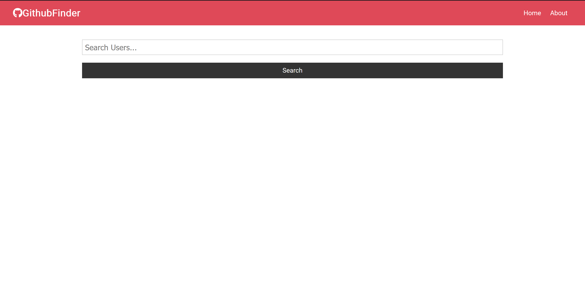
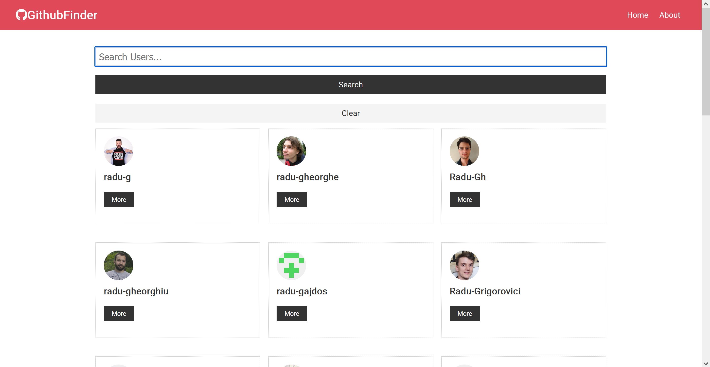
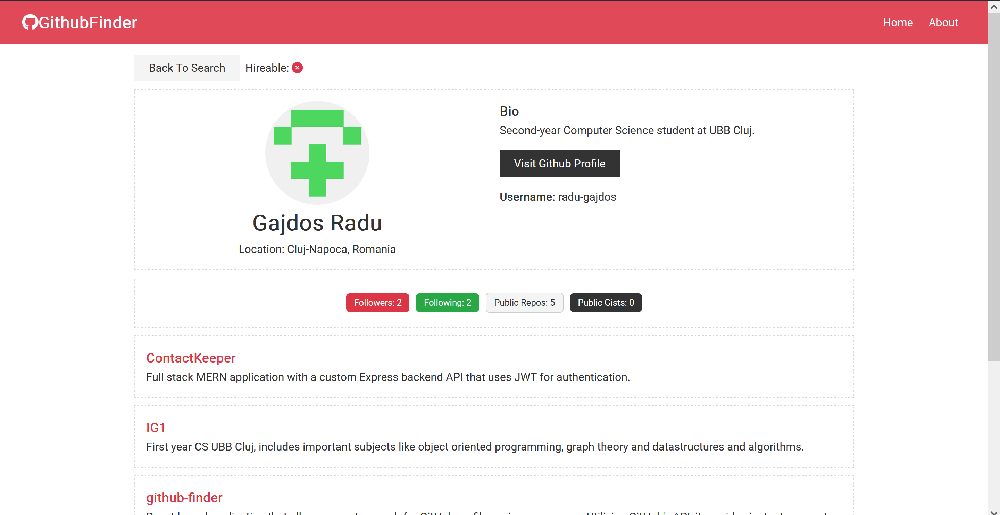
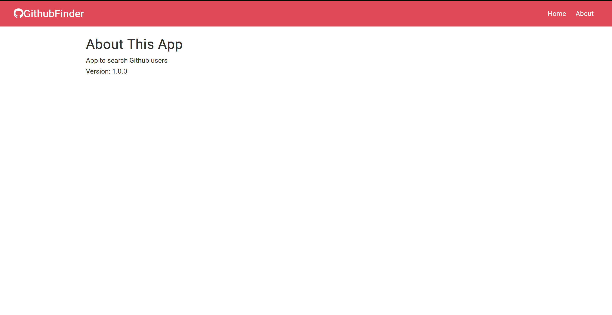

# GithubFinder

## Home Page

At first, no GitHub users are displayed; only the empty search component is visible.

*Figure 1: The empty search component on the Home Page.*

## Home Page - Users Displayed

After searching for a user, the users component will display information about the matching users. A “Clear” button appears, used for clearing the users component and returning to the initial empty state.

*Figure 2: Users displayed on the Home Page.*

Each user component also contains a “More” button. By clicking it, more information about the specific user will be displayed.

## Specific User Page

This page is separated into two parts. The first part displays standard information about the user, provided from the user's GitHub page. The second part is represented by the repos component, containing recent public repositories of the user.

*Figure 3: Specific User Page.*

---

## About Page

This page has no functionality; it simply displays information about the app.

*Figure 4: About Page.*
